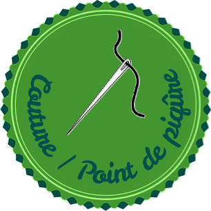
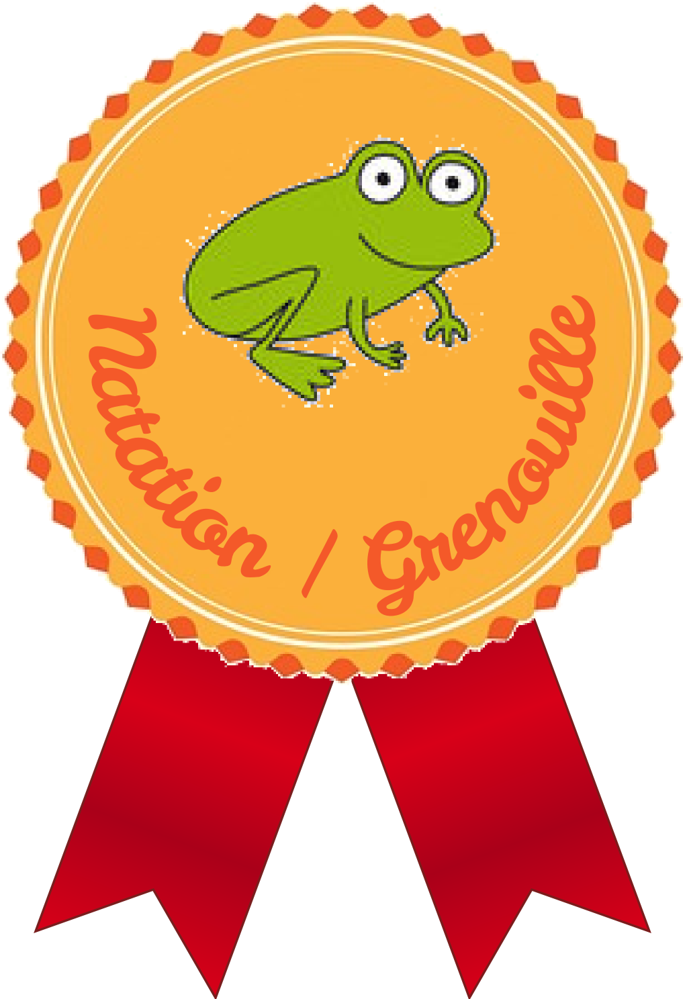

Nautilus badger generator
=========================

This is a script to generate badges from a single click on an image in Nautilus.






## Why

Because I wanted to make OpenBadges for my kids and the website generators gave ugly results.

## How to install

```shell
$ ln -s $PWD/bin/create_badge_nautilus.sh "~/.local/share/nautilus/scripts/Generate Badge"
```

## How to use

In Nautilus, right click on an image (preferably with a transparent background) and choose `Scripts → Generate Badge`.

## Examples

This repository comes with all the badges I generated so far (and more are to come). Just look around in the various folders.

## Adding badge colors

To add colors, just add files in the `color/` directory, named `<color>_badge.png`.

One simple way to do that is to edit an existing badge and change its hue saturation.

## Adding subjects

When you create a badge, you can edit one of the items in the list of subjects and make up your own.
The script will then ask you which badge color and font color you wish to use.

## TODO

- [ ] Use SVG base badges instead of PNG
- [ ] Support multiple selected files

## Contributing

PRs are welcome!
